# School_District_Analysis
An analysis of school standardized test scores using Python and Jupyter Notebook

## Overivew
Standardized tests scores for K-12 schools are reported yearly and used as a measurement of school performance. The goal of this project is to analyze standardized test scores from high school students (9th-12th grade) and report the findings to the district school board so that they can determine budget allotments for the following year. To do so, we will write a Python script using Pandas to evaluate school size, budget, reading scores, math scores, and passing rates. The board will make decisions on the following: 

    1. **School District Summary**: Overview of total schools, student size and budget, as well as average test scores for the entire district
    
    2. **Per School Summary**: Overview of size, buget, and test scores for each school within the district
    
    3. **Top and Bottom 5 Performing Schools** based on **Per School Summary**
    
    4. **Math and Reading Scores by Grade**
    
    5. **Spending Summary**: Overview of test scores based on spending ranges per student
    
    6. **School Size Summary**: Overview of test scores based on school size
        
    7. **School Type Summary**: Overview of test scores based on school type (charter or district)
    

After the original district summary was completed, it was noticed that the reading and math test scores for 9th grade students from Thomas High School appeared to be altered in the student scores datafile. To prevent potential academic dishonesty from influencing school board decisions, these scores were removed and the school district analysis was repeated.

## Results
The following compare the results from the original analysis with the updated analysis (repeat analysis with reading and math scores for Thomas High School 9th graders removed).

### *1. School District Summary*
    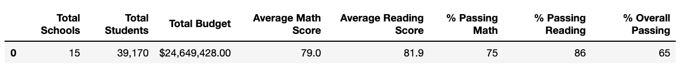
    
    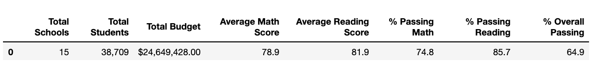
    
    We can see in the Updated School District Summary that the total number of students is 461 less than the original. This accurately reflects the students scores that were removed for further analysis. The average math score in the updated summary was minimally affected (0.1% lower than than the original), while the average reading score remained unaffected. The percent passing math and reading, as well as the percent passing overall were also minimally affected. 
    

### *2. Per School Summary*
    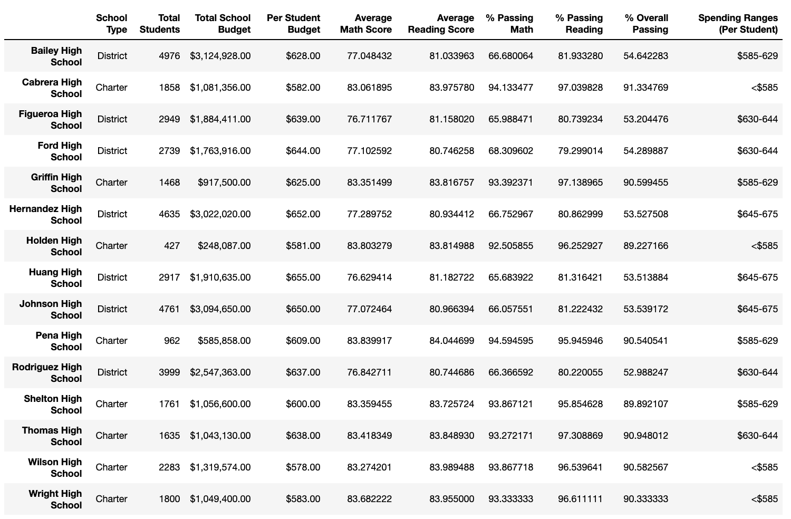
    
    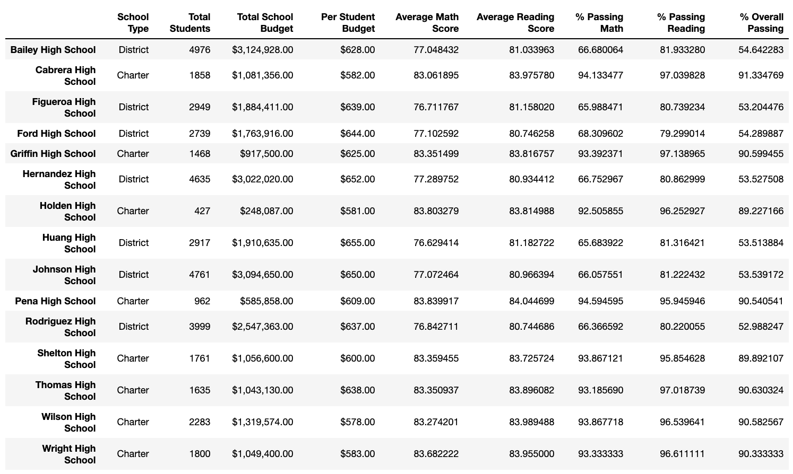
    
    The updated Per School Summary reflects minor changes to the percentage of students that passed math, reading and overall at Thomas High School. In the updated summary the percentage of students that passed math and reading at Thomas High School decreased by less than 0.5% for each metric. 

### *3. Top and Bottom 5 Performing Schools*
    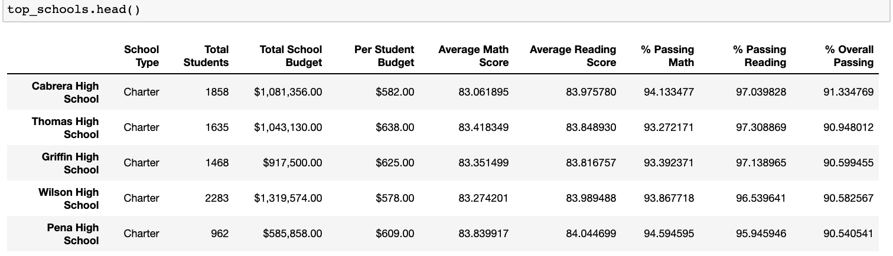
    
    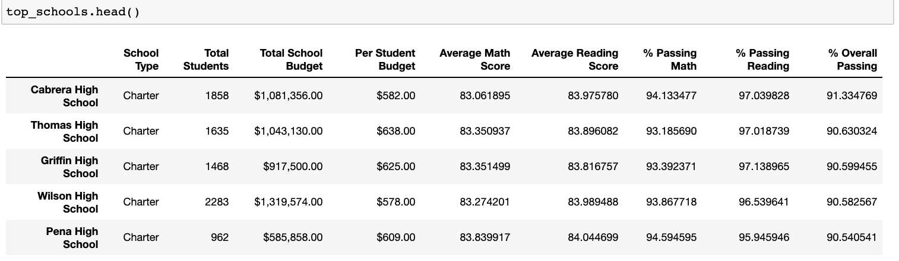
    
    From the updated analysis, we can see that Thomas High School's performance based on overall passing rate does not affect its ranking in comparison to other schools in the district. 
    
    
    The bottom 5 schools also remain the same:
    
    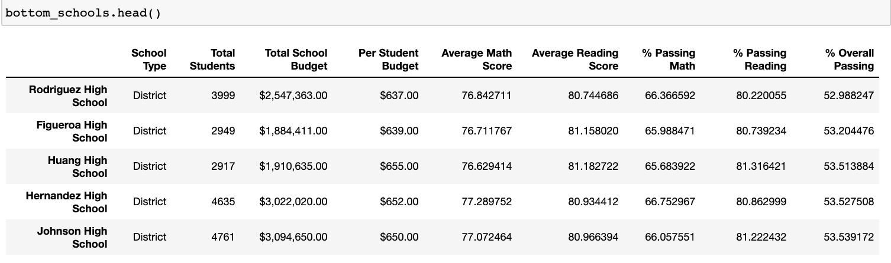
    
    
    

### *4. Math and Reading Scores by Grade*

#### Math
    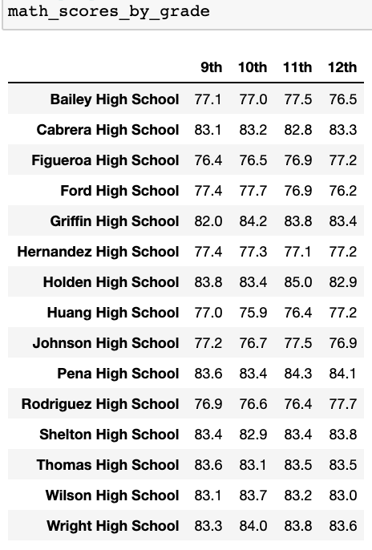
    
    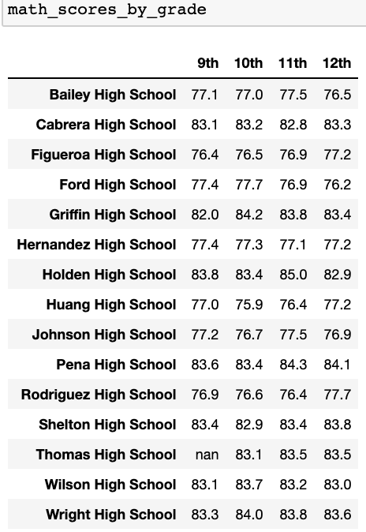
    
    
#### Reading
    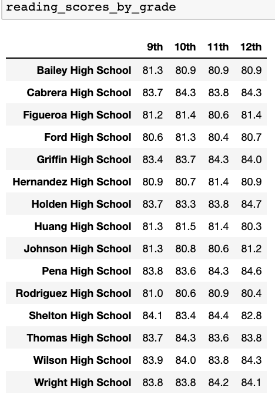
    
    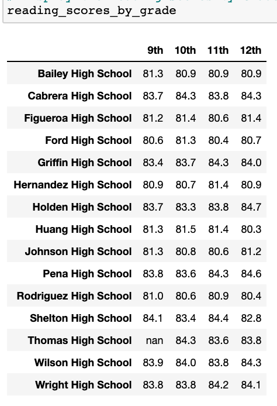
    
    The updated tables confirm that the reading and math scores for Thomas High School 9th graders were removed while leaving the other grades unaffected. 
    

### *5. Spending Summary*
    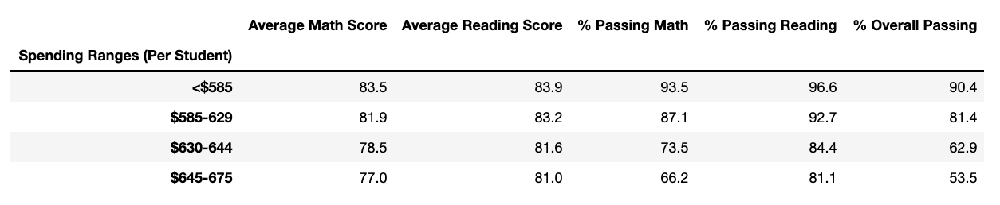
    
    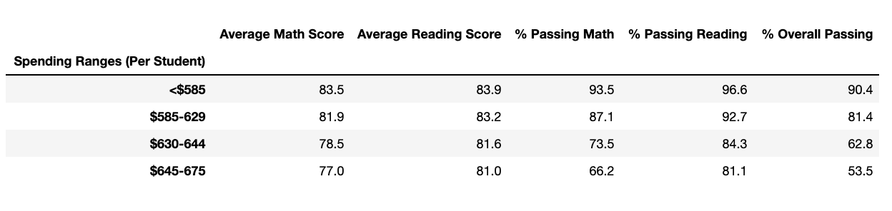
    
    The metrics for passing scores based on spending per student were not impacted in the updated analysis.

### *6. School Size Summary*
    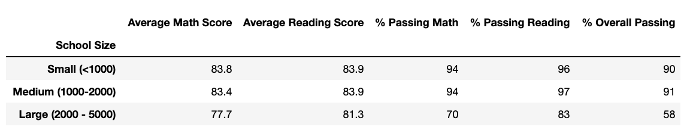
    
    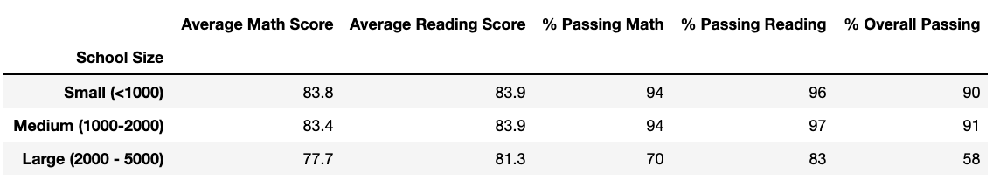
    
    The metrics for passing scores based on school size were not impacted in the updated analysis.
    

### *7. School Type Summary*
    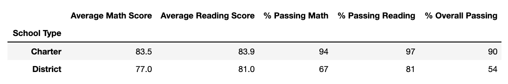
    
    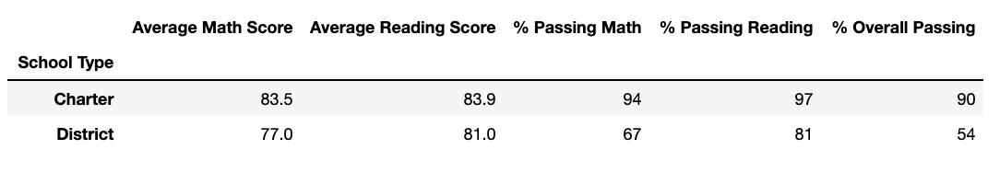
    
    The metrics for passing scores based on school type (District or Charter) were not impacted in the updated analysis.

## Summary
After repeating the analysis with the altered scores removed from the dataset, there were slight changes in the percentage of students that passed math and reading at Thomas High School, but this did not significantly impact any of the summary metrics (Spending Summary, School Size Summary, Overall Performance, and School Type Summary). 

Results that were impacted:

    1. The school district summary - Percent passing scores for reading, math, and overall were slightly lower in the repeat analysis.
    
    2. The per school summary - Percentage of students that passed reading, math and overall were also slightly lower (by less than 0.5%).
    
    3. Math Scores by Grade - The updated analysis shows the 9th grade scores from Thomas High School were removed and replaced with NaN. The district will not be able to make conclusions about this grade's math performance as a result.
    
    4. Reading Scores by Grade - The updated analysis shows the 9th grade scores from Thomas High School were removed and replaced with NaN. The district will not be able to make conclusions about this grade's reading performance as a result.

The original reading and math scores for Thomas High School 9th graders are within half a percent of 10th-12th grade scores, which is likely why the school's overall performance in comparison to other district schools remained the same, and why other summary metrics were also unaffected. 

From these findings, the School Board does not need to make any major changes in their budget allottment decisions for the following year. They should investigate further into Thomas High School to determine the full extent of the academic dishonesty, but based on the results presented in this analysis, the altered grades had little impact on overall summary metrics. 